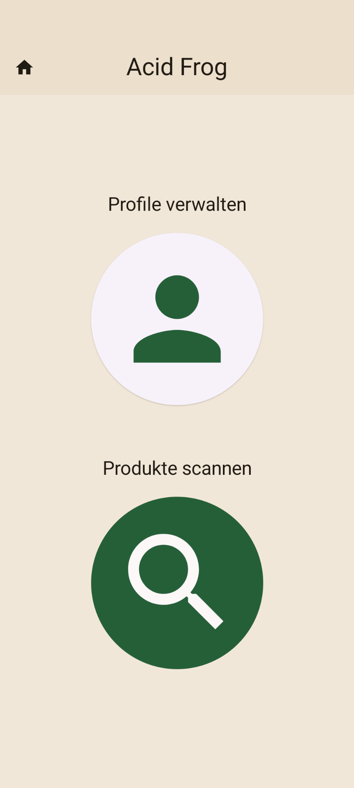
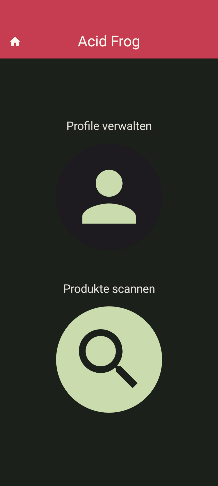
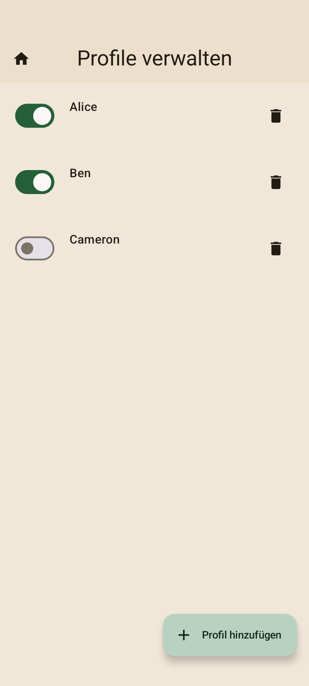
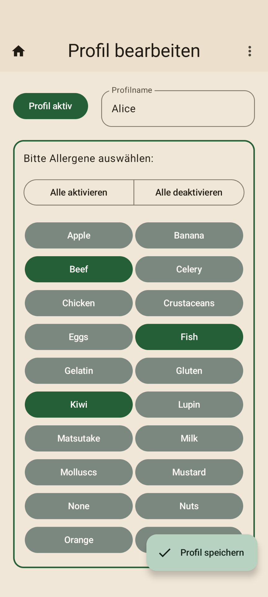
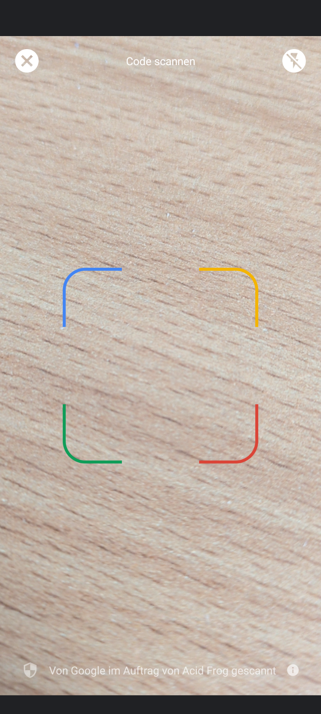
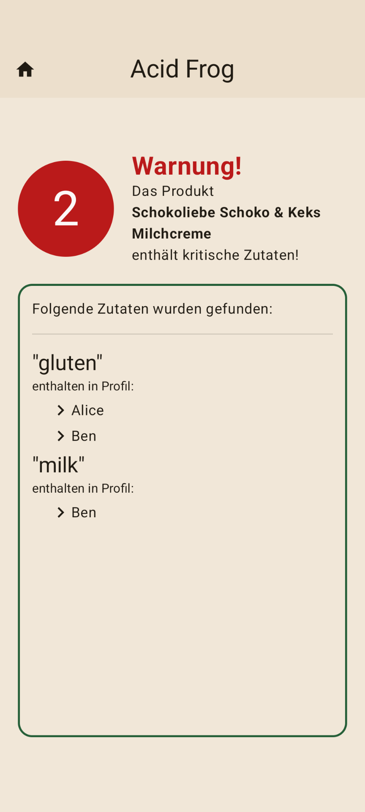
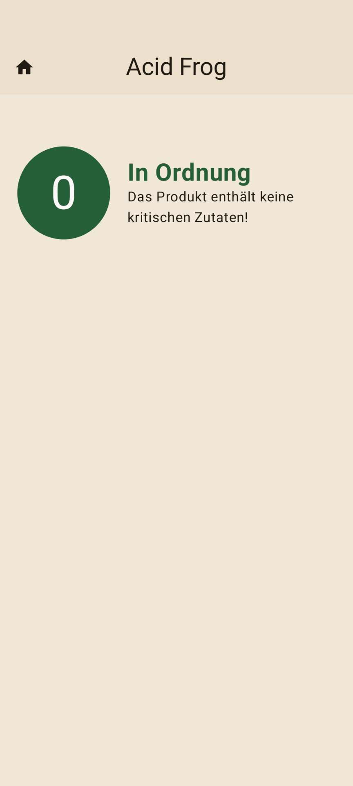

    
    <h1>ACID FROG</h1>
    

    <strong>The colors mean it's bad for you.</strong>
    

# About

In today's world, we have the opportunity to create various foods and beverages with influences from all over the world. Having a diverse and nutrient-rich diet is not only beneficial in terms of health reasons. It also bears the capability of enhancing the joy at the table. Especially when new eating experiences are shared with others at special occasions.

But planning such events becomes more and more tedious the more people are involved: Everyone has different allergies or general eating habits, making it difficult for the person buying the food to keep track of all the constraints at hand.
In those situations, we often resume by buying "the same old", to avoid irritating or harming the people we care about.

This is where Acid Frog comes in. Making it easy to tell if a product is suitable for a group of people, or if you should leave it at the store.

# Screenshots and Feature Overview

## Home Screen

The application provides a light and dark mode:

  
  

## Profile Management and Detail Screen

Create, edit and delete different profiles:

  
  

## Scanner Screen

Scan product using the in-app barcode scanner:

## Result Screen

Instantly see the result of your scan:

  
  

